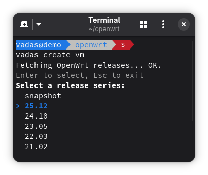
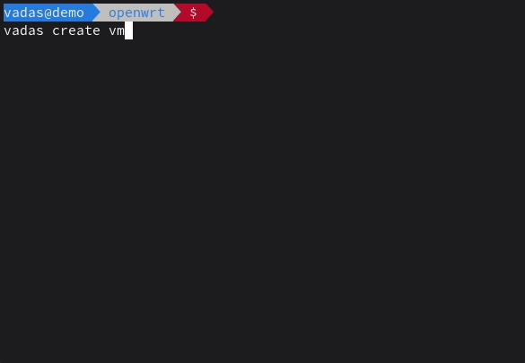

# Vadas



Vadas is a command-line tool for managing OpenWrt virtual machines using
QEMU/KVM and libvirt. It simplifies the process of downloading official OpenWrt
images, creating, and configuring VMs for various architectures, and managing
their lifecycle.

Vadas means commander, leader, or chief in Lithuanian.

Supported OpenWrt versions: 21.02+, release snapshots, and snapshots

Supported architectures (depending on the availability in a release):

- armsr/armv8
- malta/be
- malta/le
- x86/64
- x86/generic

## Features

- **Multi-Architecture**: Seamlessly creates VMs for x86-64, ARMv8, and MIPS,
  both for release versions and snapshots.
- **Simplified Networking**: Automates OpenWrt network configuration (separate
  WAN and LAN, IP, gateway, DNS) via config injection through a serial console,
  so newly-created VMs get internet access out of the box.
- **Image Management**: Automatically downloads, verifies, and caches official
  OpenWrt images; cleans up unused artifacts.
- **Interactive CLI**: Menu-driven interface for ease of use, with Bash
  completion support for VM names and paths.
- **File Transfer**: Integrated `cp` command to transfer files between host and
  guest.

## Dependencies

This script requires the following tools to be installed:
- `bash` (v4.1+)
- `coreutils` (`sha256sum`, `gunzip`)
- `curl`
- `edk2-aarch64` for aarch64 QEMU EFI support
- `expect`
- `iproute2` (`ip`)
- `jq`
- `libvirt-client` (`virsh`)
- `libxml2` (`xmllint`)
- `openssh-clients` (`scp`)
- `qemu-system-*` (e.g., `qemu-system-x86`, `qemu-system-aarch64`)
- `virt-install` (`virt-xml`)

## Setup

### Virsh (non-root user)

To allow `virsh` to be managed by a non-root user, add your user to the
`kvm` and `libvirt` groups. A new login session is required for this change
take effect.

```shell
sudo usermod -aG kvm,libvirt $(whoami)
```
Vadas assumes a working libvirt and QEMU/KVM setup on a x86-64 host.

### Installation

```shell
make install
```

Installs the main script into `~/.local/bin`. Ensure this directory is in path.

Bash completion script is installed into `~/.local/share/bash-completion/completions`.

Both of these paths can be adjusted by setting the following variables before
calling the install script:

```shell
VADAS_BIN_DIR=~/.bin \
VADAS_BASH_COMPLETION_DIR=~/.something/else \
make install
```

The rest of the files are placed into `~/.config/vadas`.

This has only be tested on a modern Linux with all the dependencies installed.
It is highly unlikely this will work on a macOS without further modification.

## Usage

First interactively create the virtual WAN and LAN networks:

```shell
vadas create network
```

> [!NOTE]
>
> WAN should be tied to a network adapter connected to the internet.
>
> Both networks shouldn't overlap with each other or any other network ranges
> that are in use.

Then interactively create a virtual machine:

```shell
vadas create vm
```
You'll be able to select OpenWrt version, target and image type. Optionally the
network can be configure on the VM during the setup.

Connect to the newly-create VM either during setup, or by doing:

```shell
vadas start [<vm_name>]
```

If `vm_name` is not provided, you can select a VM from the list interactively.

> [!NOTE]
>
> Press `Ctrl+]` to exit the console connection to a VM.

## Demo



[Longer demo on YouTube](https://www.youtube.com/watch?v=-uD7iaaJeXQ)

## CLI reference

```shell
vadas <command> [<subcommand>] [<options>]
```

When no arguments are supplied, most commands are interactive.

## Commands

| Command | Description |
|-:|:-|
| `clean cache`                    | Clean up cache files. |
| `clean images`                   | Remove disk images not used by any VM. |
| `clean temp`                     | Remove temporary files. |
| `env`                            | Display environment variables used by `vadas`. |
| `configure vm [<vm_name>]`       | Automatically configure the network for a running VM via its console. |
| `cp [-r] <src> ... <dest>`       | Copy files and directories to and from a VM. |
| `create network`                 | Interactively create the `vadas-wan` and `vadas-lan` virtual networks. |
| `create pool`                    | Create the `vadas` storage pool. |
| `create vm`                      | Interactively download an OpenWrt image and create a new VM. |
| `list images`                    | List all downloaded disk images. |
| `list vm`                        | List all VMs managed by `vadas`. |
| `pause [<vm_name>]`              | Pause a running VM. |
| `ps [--all]`                     | List running VMs. `--all` includes paused VMs. |
| `resume [<vm_name>]`             | Resume a paused VM. |
| `remove network`                 | Remove the `vadas-wan` and `vadas-lan` virtual networks. |
| `remove pool`                    | Remove the `vadas` storage pool. |
| `remove vm [<vm_name>]`          | Remove a VM and its associated storage. |
| `show ip [<vm_name>]`            | Show the IP address of a VM. |
| `start [<vm_name>]`              | Start a VM and connect to its console. |
| `stop [<vm_name>] [--force]`     | Shut down a VM. `--force` will destroy it. |

## Environment Variables

- `VADAS_CACHE_DIR`: Cache directory (default: `$HOME/.cache/vadas`).
- `VADAS_CONFIG_DIR`: Configuration directory (default: `$HOME/.config/vadas`).
- `VADAS_IMAGE_DIR`: Image storage directory (default: `$VADAS_CONFIG_DIR/images`).
- `VADAS_TEMPLATE_DIR`: Template directory (default: `$VADAS_CONFIG_DIR/templates`).
- `VADAS_TEMP_DIR`: Temporary file directory (default: `/tmp/vadas`).

These can be tweaked to change the paths, but this has not been tested.

## License

GNU General Public License v2.0 only
